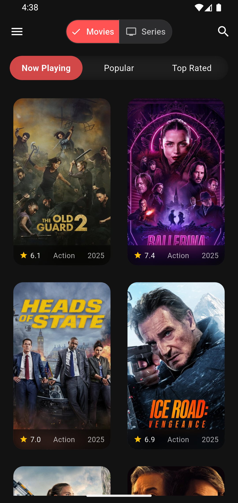
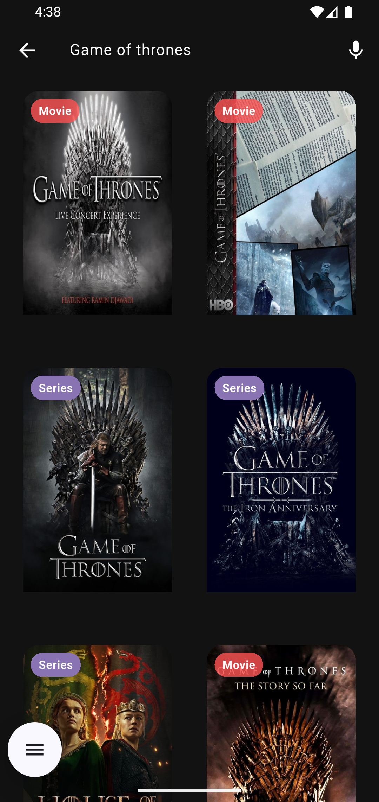
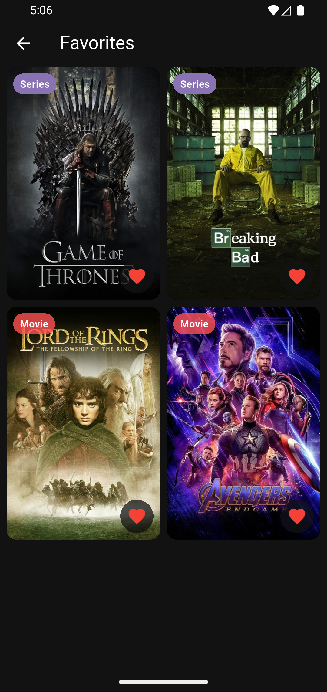
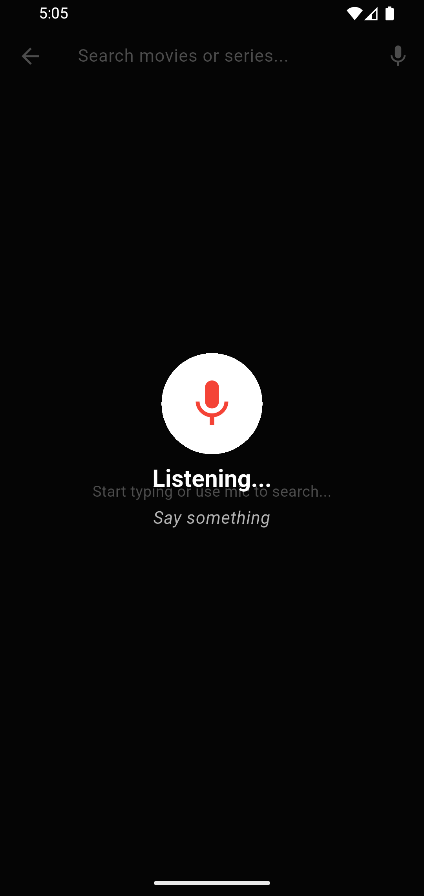

# 🎬 Movie Sansaar

Movie Sansaar is a modern Flutter-based movie and TV series discovery app powered by the [TMDB API](https://www.themoviedb.org/).  
It features rich search, voice recognition, favorite tracking, hosted playback support, and a sleek streaming-style UI.


---

## 🚀 Features

- 🔍 **Smart Search** – Find movies and series by title using a dynamic grid layout
- 🎤 **Voice Search** – Search with your voice using speech-to-text
- ❤️ **Favorites** – Add/remove movies and series to a unified favorites list
- 🎥 **Trailer & Playback** – Watch YouTube trailers or self-hosted full movies
- 🌐 **TMDB API Integration** – All metadata pulled from The Movie Database
- 📱 **Responsive UI** – Designed for modern mobile devices with dark mode support
- 🔒 **Firebase Auth + Firestore** – Secure login and user-based favorites storage

---

## 📦 Download APK

> 👉 [Download Latest APK](https://github.com/iamdipesh18/movie_sansaar_mobile/releases/latest)

Or build locally (see below).

---

## 📷 Screenshots

| Home | Search | Favorites | Voice |
|------|--------|-----------|-------|
|  |  |  |  |

> (Add your own screenshots in `assets/screenshots/` and update this table.)

---

## 🛠️ Installation & Setup

### 🔧 Prerequisites
- Flutter SDK (3.8.1 or higher)
- Dart SDK
- Android Studio or VS Code
- Firebase project (for Auth and Firestore)

### 🧪 Run Locally

```bash
git clone https://github.com/iamdipesh18/movie_sansaar_mobile.git
cd movie_sansaar_mobile
flutter pub get
flutter run
